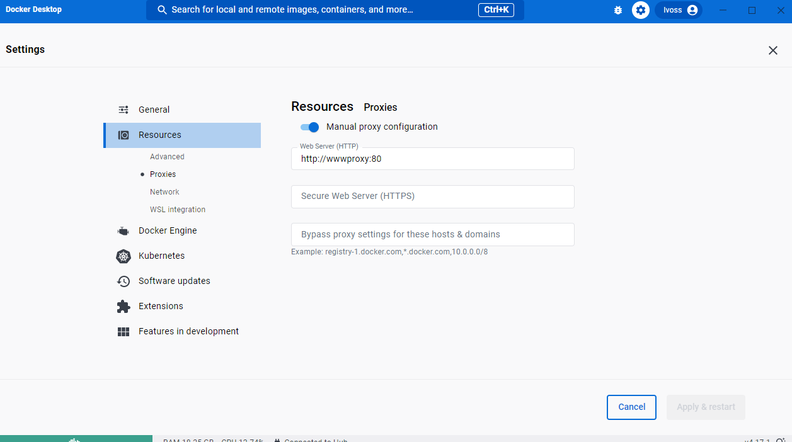

# Template für Ausbildungsprojekte mit Angular, Quarkus und Postgres

## Was ist in diesem Repository enthalten

Dies ist ein monorepo, denn es fasst mehrere Teilprojekte in einem git repository zusammen.

1. Angular Frontend Projekt (im Ordner [frontend](./frontend/))
2. Quarkus / Java Backend Projekt (im Ordner [backend](./backend))
3. ein Docker Container setup mit einer PostgreSQL Datenbank

## Wie beginne ich die Entwicklung

Hier beschreiben wir die Schritte, die auszuführen sind, um Code live zu editieren und auszuprobieren.

Vorbedingungen:

- Du hast dieses git repository `geklont` ([Hilfe dazu hier](README-git.md))
- Du hast [Docker Desktop](docker.com) installiert (Windows oder MacOS)
- Du hast ein Terminal mit einem shell prompt, um die folgenden Kommandozeilen eingeben zu können (Anleitung dazu [hier](README-terminal.md))
- Du hast Java 17 installiert - oder benutzt Visual Studio Code DevContainers [Anleitung](README-devcontainers.md)
- Du hast Node installiert - oder benutzt Visual Studio Code DevContainers [Anleitung](README-devcontainers.md)

Hinweise:
  - > Den von dir im Terminal auszuführenden Dialog zeigen wir nun zusammen mit den zu erwartenden Ausgaben an. Die Ausgaben erkennst du durch den farblich abweichenden Druck und das vorangestellte Kommentarzeichen `#`.
  - > der prompt zeigt auch das aktuelle Arbeitsverzeichnis an, so wie hier:
    >
    > ```bash
    >  # vscode ➜ /workspaces/template-ausbildung (main) $
    > ```

Zu Beginn jeder Arbeitssitzung führst Du diese Schritte aus:

- Baue und starte die notwendigen Docker container durch Eingabe im Terminal von:

  ```bash
  # vscode ➜ /workspaces/template-ausbildung (main) $
  docker compose up -d
  # [+] Running 3/3
  # ✔ Container template-ausbildung-adminer-1   Started             0.4s
  # ✔ Container template-ausbildung-pgadmin-1   Started             0.6s
  # ✔ Container template-ausbildung-postgres-1  Started             0.6s

  ```

- Beginne die Java-Entwicklung in einem neuen Terminal-Fenster


  - mit dem Starten des Live Reload Modus durch Eingabe im Terminal von:

    ```bash
    # vscode ➜ /workspaces/template-ausbildung (main) $
    cd backend
    # drück danach return und erhalte diesen prompt:
    # vscode ➜ /workspaces/template-ausbildung/backend (main) $
    ./mvnw quarkus:dev
    # [INFO] Scanning for projects...
    # [INFO]
    # [INFO] ----------------------< de.sninvent:task-backend >----------------------
    # [INFO] Building task-backend 1.0.0-SNAPSHOT
    # [INFO] --------------------------------[ jar ]---------------------------------
    # [INFO]
    # [INFO] --- quarkus-maven-plugin:2.16.5.Final:dev (default-cli) @ task-backend ---
    # [INFO] Invoking org.apache.maven.plugins:maven-resources-plugin:2.6:resources @ task-backend
    # ... (blockiert)
    ```

  - die shell ist nun für weitere Eingaben blockiert, da hier das Log der Quarkus Anwendung ausgegben wird

- Beginne die Angular-Entwicklung

  - mit dem Starten des Live Reload Modus:

    ```bash
    # vscode ➜ /workspaces/template-ausbildung (main) $
    cd frontend
    # vscode ➜ /workspaces/template-ausbildung/frontend (main) $
    npm install -g @angular/cli
    npm install
    ng serve
    # ✔ Browser application bundle generation complete.
    #
    # Initial Chunk Files   | Names         |  Raw Size
    # vendor.js             | vendor        |   4.63 MB |
    # styles.css, styles.js | styles        | 327.77 kB |
    # polyfills.js          | polyfills     | 314.27 kB |
    # main.js               | main          |  41.59 kB |
    # runtime.js            | runtime       |   6.51 kB |
    #
    #                       | Initial Total |   5.30 MB
    #
    # Build at: 2023-04-11T10:23:57.259Z - Hash: d7c74158117a239c - Time: 4350ms
    #
    # ** Angular Live Development Server is listening on localhost:4200, open your browser on http://localhost:4200/ **
    #
    #
    # ✔ Compiled successfully.
    # ... (blockiert)
    ```

Beide Terminals sind nun blockiert. Du kannst die Kommandos, die dort nun laufen, durch Eingabe von <kbd>CTRL</kbd>+<kbd>C</kbd> beenden bzw. abbrechen

## Aufrufen der Web-Applikation

Nachdem Du nun frontend wie backend gestartet hast, kannst Du die Web-Applikation im Browser aufrufen:

- rufe die Web-Applikation im Browser auf unter
  - <http://localhost:4200>

### Fertig!

Solange wie die beiden Kommandos für frontend und backend laufen, werden Änderungen an den Quellcode Dateien automatisch übernommen und die Web-Applikation neu gebaut und geladen.

*Viel Spaß beim Codieren!*

---
## Weitere Themen
### Datenbank

Falls Du in die Datenbank schauen willst:

- im Datenbank-Tool muss die Datenbank verbindung eingerichtet werden.
  - [hier findest du die Anleitung dazu](backend/README-Datenbank.md)

---
## Bei Problemen: troubleshooting
### 1. `2023-03-30 17:31:37,884 ERROR [io.qua.ver.htt.dep.dev.HttpRemoteDevClient] (Remote dev client thread) Remote dev request failed: java.net.ConnectException: Connection refused`

- prüfe dass du das Quarkus backend im browser unter http://localhost:8080 erreichst:
- WENN NICHT:

  - prüfe dass du das Quarkus backend mit `docker compose up -d` gestartet hast
  - prüfe dass im [docker-compose.yml](docker-compose.yml) das backend auf port 8080 gemappt wird:

    ```bash
    backend:
    build:
      context: ./backend
      dockerfile: ./src/main/docker/Dockerfile.jvm.multistaged
    image: backend
    depends_on:
      - postgres
    ports:
      - 8080:8080
    ```
### 2. Falls der devcontainer nicht startet, dann prüfe die Proxy-Einstellungen von Docker Desktop. Setze in den Einstellungen den HTTP-Proxy auf `http://wwwproxy:80`, wenn du im S&N-Intranet bist:



### 3. Wenn du diese Fehlermeldung bekommst, dann prüfe die Umgebungsvariable JAVA_HOME. Diese muss auf das JDK 17 zeigen.

- Fehlermeldung:

  ```bash
  [INFO] ------------------------------------------------------------------------
  [INFO] BUILD FAILURE
  [INFO] ------------------------------------------------------------------------
  [INFO] Total time:  01:10 min
  [INFO] Finished at: 2023-04-05T15:06:39+02:00
  [INFO] ------------------------------------------------------------------------
  [ERROR] Failed to execute goal io.quarkus.platform:quarkus-maven-plugin:2.16.5.Final:dev (default-cli) on project task-backend: Fatal error compiling: error: release version 17 not supported -> [Help 1]
  ```

- Umgebungsvariable JAVA_HOME muss gesetzt sein!:

  ```bash
  # unter Windows
  echo $env:JAVA_HOME

  # oder unter Linux/MacOS:
  echo $JAVA_HOME
  ```

- die Variable JAVA_HOME, muss auf den Ordner zeigen, in dem das Java Programm liegt

  ```bash
  # unter Windows
  echo $env:JAVA_HOME

  # oder unter Linux/MacOS:
  echo $JAVA_HOME
  ```
