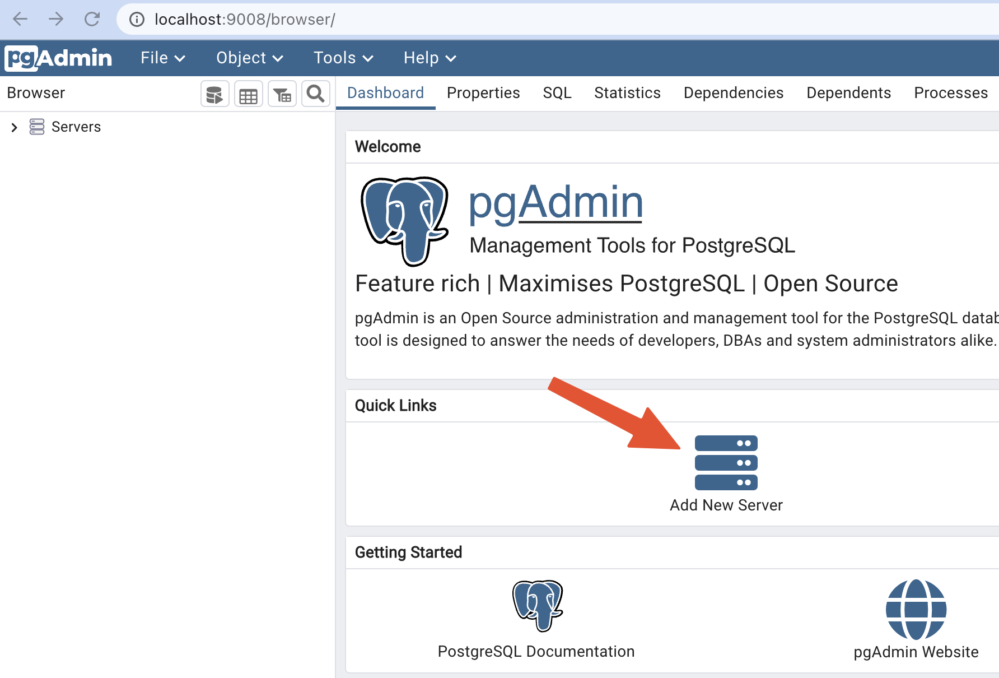
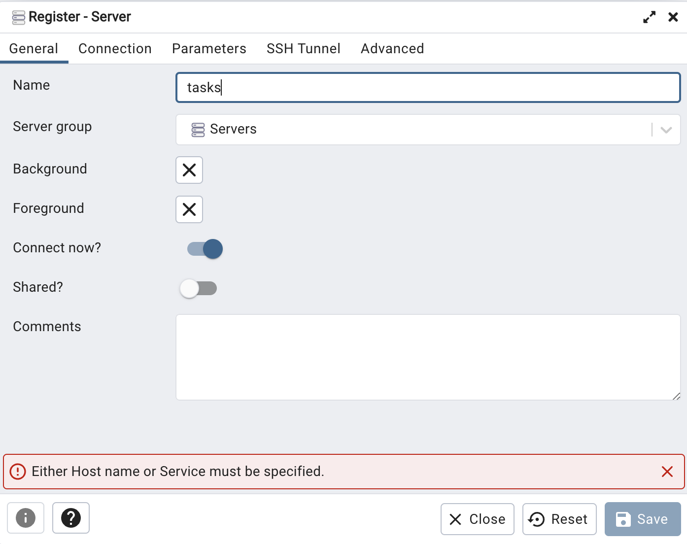
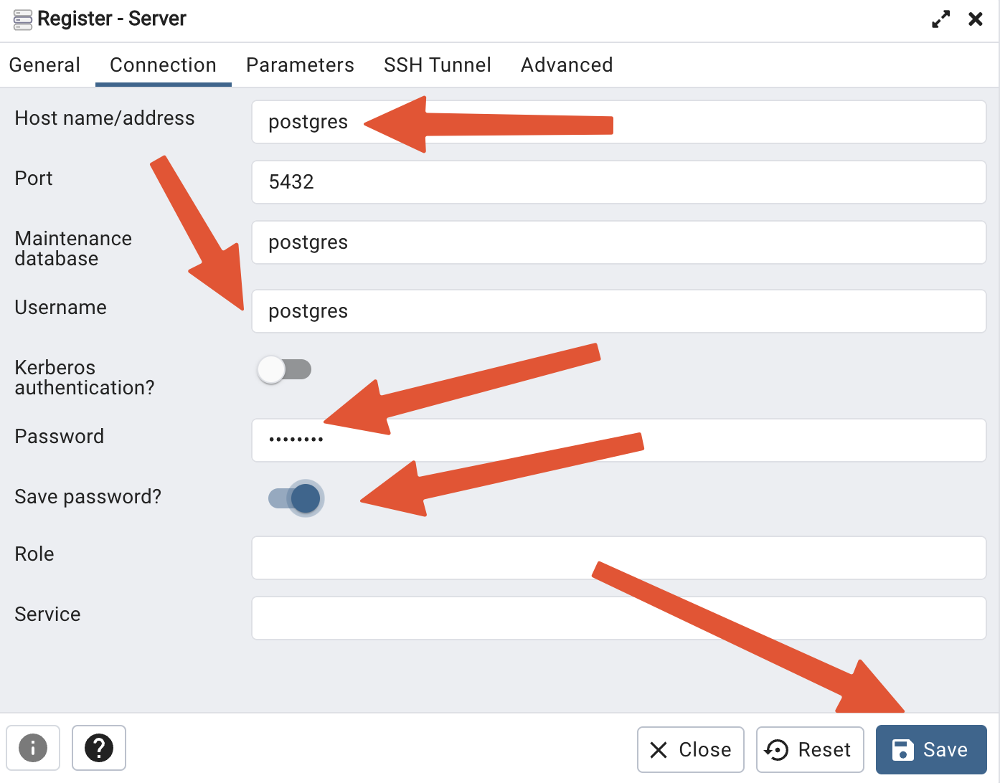
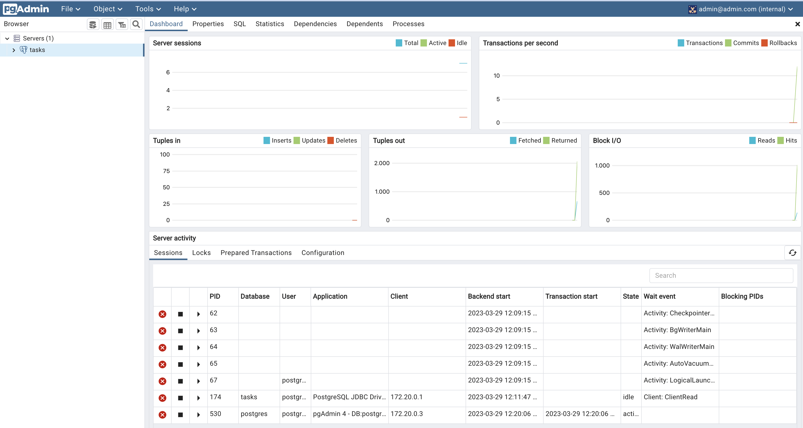
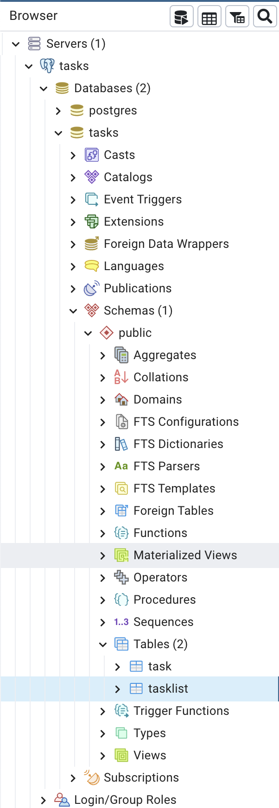

# Die PostgreSQL Datenbank

## Starten

1. Starte die Datenbank und das Datenbank Frontend (`pgadmin`) mit diesem Kommando:

    ````bash
    docker compose up -d
    ````

## Admin-Zugriff auf die Datenbank

1. Starte Deinen lokalen Browser und gehe auf die URL <http://localhost:9008/>

    Einlogen mit `admin@admin.com`und Password `root`

1. Klick auf `Add New Server`

    

1. Nenne die neue Verbindung `tasks`

    

1. Klick auf die `Connection` Lasche

    

        * Host name/address: `postgres`
        * Username: `postgres`
        * Password: `password`
        * Save Password: `aktivieren`

1. Die PG-Admin Oberfläche öffnet sich

    

3. Navigiere in die Datenbank, in dein Schema und zu den Tabellen

    
